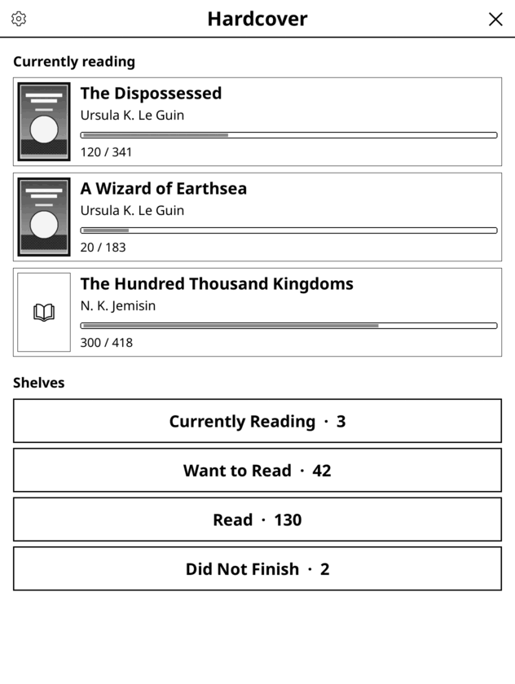
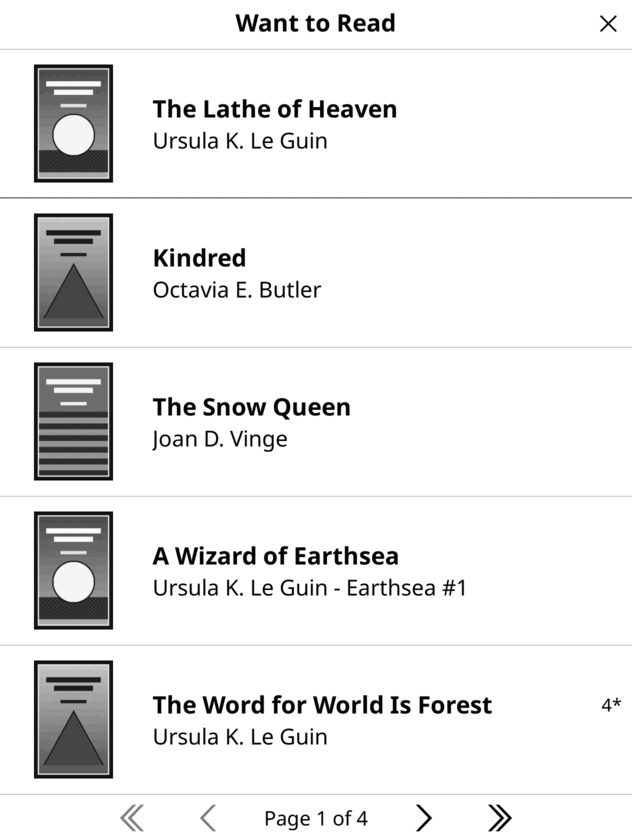
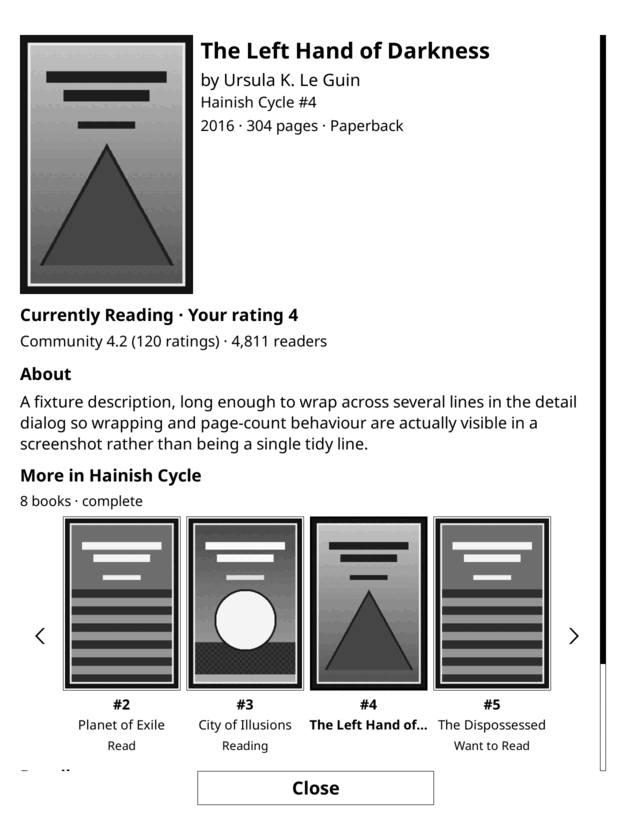
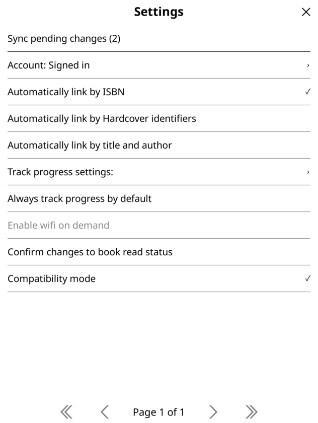
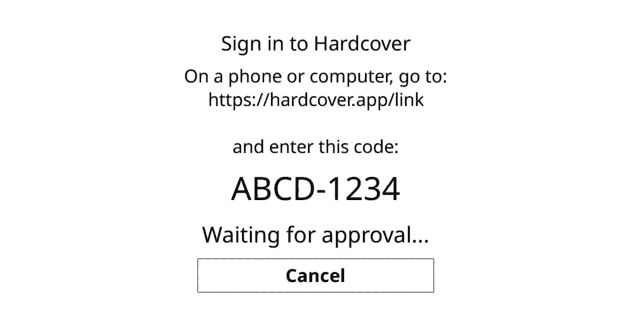

# Hardcover Sync for KOReader

A KOReader plugin to track your reading on [Hardcover.app](https://hardcover.app) and browse your library: a home
screen with what you are reading and your shelves, book details with the rest of the series, offline shelves, and
progress and status syncing.

This is a fork of Billiam's [hardcoverapp.koplugin](https://github.com/Billiam/hardcoverapp.koplugin), and keeps
all of its tracking features (linking books, progress and status syncing, notes and journal entries, automatic
linking). Thank you to Billiam for the original plugin. It installs as `hardcoversync.koplugin`, so it can sit next
to the original in KOReader's App Store, but **the two must not be installed together** (they register the same
actions and menus): remove `hardcoverapp.koplugin` from your plugins folder first. Your settings carry over.

<p>




</p>

*(Rendered in a desktop KOReader with placeholder covers and sample books.)*

## What this fork adds

* **A home screen**: what you are currently reading (cover, author, progress), your shelves with their counts, and a
  settings cog. Open it from the file browser menu or with the `Hardcover: Home` action, so another plugin or a
  gesture can launch it.
* **A separate menu for the reader and the file browser**: tracking and book information while reading; your library
  everywhere else.
* **Shelves as cover lists**: the whole shelf loads in the background, in full-screen rows with covers, and is saved
  for offline use.
* **A redesigned book details screen**, with the cover, ratings, your status, the description, and a carousel of
  covers for the rest of the series. Tap one to open it. Books with no cover get a placeholder.
* **Sign in with your Hardcover account** (OAuth device flow) instead of pasting an API key; no config file needed.
* **Offline tracking**: progress and status changes made offline are queued and pushed when you reconnect, with a
  `Sync now` button that greys out when nothing is waiting.
* **A settings screen** reachable from the home screen and the reader, with Sync and your account at the top.
* **Fixes and speed**: the e-ink screen is now refreshed when menus close, requests run in the background instead of
  freezing the screen, covers are cached, and long shelves load completely. See the [changelog](CHANGELOG.md).
* **Removed**: the "Suggest a book" feature.

## Installation

**From the KOReader App Store** ([appstore.koplugin](https://github.com/omer-faruq/appstore.koplugin)): search for
"Hardcover Sync". Forks with no stars are hidden by default; turn on "include zero-star forks" in the App Store's
settings if it does not appear.

**By hand:**

1. Download the latest release: https://github.com/CaptainCamin/HardcoverSync.koplugin/releases/latest
   (`hardcoversync.koplugin.zip`) and extract it
2. Copy the `hardcoversync.koplugin` folder to the KOReader plugins folder on your device
3. Restart KOReader

Signing in needs no config file (see [Signing in](#signing-in)). Rename `hardcover_config.example.lua` to
`hardcover_config.lua` only for the [advanced options](#advanced-your-own-app-or-an-api-key).

## Signing in

In the file browser, choose `Hardcover` in the menu to open the home screen, tap the cog, and choose `Account` →
`Sign in to Hardcover` (while reading, the Hardcover menu shows `Account` when you are signed out). The plugin shows a short code and a web address. Open that address on a phone
or computer, enter the code, and approve. The plugin signs itself in and keeps the connection fresh from then on.

<p></p>

*(The code shown here is made up; yours is different each time.)*

That is all: the plugin comes with its own Hardcover app registration, so you do not need to register anything or
create a config file. There is no secret to store, because this is a public client using the device flow, which is
also why no browser is needed on the reader. You can see, and revoke, the connection on Hardcover under your
authorized apps. `Account` → `Sign out` signs out and revokes it.

## Advanced: your own app or an API key

Most people can skip this. Create `hardcover_config.lua` in the plugin folder (copy `hardcover_config.example.lua`
and edit it) only if you want one of these. The file is never shipped or published, so it is safe to put a token in.

### Use your own OAuth app

Register an app of your own if you would rather not use the bundled one, for example to control its name and
permissions, or if you fork the plugin:

1. Register an app at https://hardcover.app/account/developer-apps/new
2. Set the application type to **Mobile, desktop, or CLI**, leave **Device Authorization Grant** enabled, and allow
   these scopes: `read:catalog read:catalog:search read:me:content read:library read:social write:library`
3. Put the **client id** in `hardcover_config.lua`, then sign in as above:

   ```lua
   return {
     client_id = 'your-client-id',
   }
   ```

Anyone can read a client id out of an installed app, so it is not a secret and is safe to publish; that is how the
bundled one works. If you change the client id after signing in, sign out and sign in again.

### Use a personal access token

If you would rather not sign in at all, get a token from https://hardcover.app/account/api and put it in
`hardcover_config.lua`:

```lua
return {
  token = 'abcde...fghij'
}
```

A token in the config is used instead of signing in (unless you also give your own `client_id`, which keeps OAuth).
Unlike the account sign-in, this token is a secret: do not share the file. Tokens carry an expiration and a list of
permissions, so choose ones that cover what the plugin uses, and expect to replace an expired token.

## Usage

The Hardcover plugin's menu can be found in the Bookmark top menu when a document is active.


### Linking a book

Before updates can be sent to Hardcover, the plugin needs to know which Hardcover book and/or edition your current
document represents.

You can search for a book by selecting `Link book` from the Hardcover menu. If any books can be found based
on your book's metadata, these will be displayed.


If you cannot find the book you're looking for, you can tap the magnifying glass icon in the upper left corner and
begin a manual search.


Selecting a Hardcover book or edition will link it to your current document, but will not automatically update your
reading status on Hardcover. This can be done manually from the [update status](#updating-reading-status) menu, or using
the [track progress](#automatically-track-progress) option.

To clear the currently linked book, tap and hold to the `Linked book` menu item for a moment.

After selecting a book, you can set a specific edition using the `Change edition` menu item. This will present a list
of available editions for the currently linked book. No manual edition search is available

### Updating reading status


To change your book status (Want To Read, Currently Reading, Read, Did Not Finish) on Hardcover, you open the
`Update status` menu after [linking your book](#linking-a-book). You can also remove the book from your Hardcover
library using the `Remove` menu item.

From this menu you can also update your current page and book rating, and add a new journal entry

Tap and hold the book rating menu item to clear your current rating.

### Add a journal entry quote

Selecting text to quote:


![A form window titled "Create journal entry". The previously selected text appears in an input field at the top. Below that is a toggle for whether the journal entry should be a note or a quote. A button to change the journal edition follows, and one to change the current page. Below those, a toggle to change the journal entry privay with the options Public, Follows and Private. Lastly are two input fields to set journal entry tags and spoiler tags respectively, and then buttons to save the entry or close the window](https://github.com/user-attachments/assets/c386f153-330f-4e1f-afa1-12fdf48a1216)

After selecting document text in a linked document, choose `Hardcover quote` from the highlight menu to display the
journal entry form, prefilled with the selected text and page.

### Automatically track progress

Automatic progress tracking is optional: book status and reading progress can instead be
[updated manually](#update-reading-status) from the `Update status` menu.

When track progress is enabled for a book which has been linked ([manually](#linking-a-book)
or [automatically](#automatic-linking)),
page and status updates will automatically be sent to Hardcover for some reading events:

* Your current read will be updated when paging through the document, no more than once per minute. This frequency
  [can be configured](#track-progress-frequency).
* When marking a book as finished from the file browser, the book will be marked as finished in Hardcover
* When reaching the end of the document, if the KOReader settings automatically mark the document as finished, the
  book will be marked as finished in Hardcover. If the KOReader setting instead opens a popup, the book status will be
  checked
  ten seconds later, and if the book has been marked finished, it will be marked as finish in Hardcover.

For all documents, but in particular for reflowable documents (like epubs), the current page in your reader may not
match that of the original published book.

Some documents contain information allowing the current page to map to the published book's pages. For these documents,
the mapped page will be sent to Hardcover if possible.

For documents without these, your progress will be converted to a percentage of the number of pages in the original
published book, with a calculation like:
`round((document_page_number / document_total_pages) * hardcover_edition_total_pages)`.

In both cases, this may not exactly match the page of the published document, and can even be far off if there
are large differences in the total pages.

### Reading offline

Progress tracking keeps working without a connection. After each successful sync the plugin saves a local copy of
the book's status and position, so opening a linked book with no network rebuilds your position from that copy and
keeps recording from there. Page turns and status changes made while offline are held in a queue and pushed to
Hardcover as soon as a connection is available — including when you reconnect, resume the device, or close the
document.

The menu shows how many changes are waiting:

* `Sync now` — no changes waiting. Select it to sync on demand.
* `Sync pending changes (n)` — `n` changes are queued. Select it to sync now, or when offline it will tell you
  they will sync later.
* Tap and hold either to discard everything queued, after confirming.

If a sync fails, the changes stay queued and are retried later rather than dropped.

### Book details

`Book details` shows everything Hardcover knows about a book: the cover beside the title, author, series and a line
of facts (year, pages, format), then your status and rating, the community rating and readers, the description, and
the other details (publisher, language, ISBN). A book with no cover shows a placeholder.

If the book is in a series, **More in the series** is a row of covers with each book's number, title and your own
status (Read, Reading, Want to Read). The book you are on has a heavy border. Longer series have arrows either side
to page through. Tap a cover to open that book on top; Close brings you back. The series is fetched after the
details appear, and is left out when you are offline.

**Reviews**, a button under the description, shows what other readers wrote about the book: the most liked first,
ten to a page, each with the reader's name (or "A reader" when they keep their account private), their rating
(like `4.5*`), the likes, and the start of the review. A long review ends in "Read more >"; tap it to read the whole
text in a scrollable viewer. A review marked as containing spoilers is hidden behind "Contains spoilers - tap to show"
until you tap it. "Load more reviews" at the end fetches the next ten. Nothing is fetched until you press Reviews, and
it needs a connection (it says so when you are offline). It uses the `read:social` permission you grant when you
sign in.

The **Shelf** button beside Close puts the book on a shelf: it reads `Add to shelf` for a book that is not in your
library and `Shelf: <status>` for one that is. Tap it to choose Want to Read, Currently Reading, Read or Did Not
Finish, or (for a book already in your library) `Remove from library`, which asks first. Your status line and the
button update in place. This needs a connection; offline it tells you so and changes nothing.

### Where things are

The Hardcover entry in the menu is different in the reader and in the file browser.

**In the reader** it is about the book you have open: linking it, tracking progress, status, rating, notes, book
details, sync, and the tracking settings. `Settings` there includes your account (to sign out); if you are signed
out, an `Account` entry also appears at the top level so you can sign in.

**In the file browser** it is not a menu at all: choosing `Hardcover` opens your home screen. Everything that used to
be on the first menu screen (sync, your account, the settings and About) is behind the cog in its title bar.

### Home screen

`Hardcover` in the file browser menu opens your home screen:

* **Search books**: the button at the top opens a box for a title or author. Submitting shows the first 25 matches as
  a list of covers; tap one for its details, and close the list to come back. It needs a connection.
* **Currently reading**: a card for each book you are reading, with its cover, author and a progress bar
  (`pages read / pages`). Tap a card to open that book's details.
* **Shelves**: Currently Reading, Want to Read, Read and Did Not Finish, each with how many books are on it. Choose
  one to browse it; closing the shelf brings you back.
* **The cog** in the upper left opens the settings.

It opens with what it last saved, so it also works with no connection, and refreshes in the background (the screen
only repaints if something changed).

There is also a `Hardcover: Home` action, available wherever KOReader lists actions (gestures, profiles, quick
menus), so you can open the home screen from anywhere, including while reading, or have another plugin launch it.

### Settings screen

The cog on the home screen opens the plugin's settings in a screen of their own, with `Sync` and your Hardcover
account (sign in, sign in again, sign out) at the top, then the options listed below, then `About` (version, latest
release, project and settings file). Options show a tick when on;
groups open and have a `Back` row. The same settings are in the Hardcover menu in the reader and file browser.

### Browsing your lists

Choosing a shelf opens it full screen: five rows a page, each a cover, the title and the author (with the series,
if it is in one), and your rating on the right if you have given one. Select a book to open its details. The whole
shelf is loaded: the first books appear straight away and the rest arrive in the background; a shelf of several
hundred books is fetched in a few requests, waiting briefly if Hardcover asks you to slow down. If loading is
interrupted (for example by tapping the screen while it loads, or by losing your connection), a reload icon appears
in the upper left so you can carry on from where the list stops.

**Sorting.** The button in the upper left of a shelf opens `Sort by`: date added (newest or oldest first), title (a
leading "The", "A" or "An" is ignored), author (by surname), year published, pages, most readers on Hardcover,
community rating, or your own rating. Each shelf remembers its order, and the title shows it when it is not the
default. Sorting works on the loaded list, so it needs no connection.

Lists you have opened are saved on the device, so they also open with no connection, showing the saved copy.

## Settings


### Automatic linking

With automatic linking enabled, the plugin will attempt to find the matching book and/or edition on Hardcover
when a new document is opened, if no book has been linked already. These options are off by default.

* **Automatically link by ISBN**: If the document contains ISBN or ISBN13 metadata, try to find a matching edition for
  that ISBN
* **Automatically link by Hardcover**: If the document metadata contains a `hardcover` identifier (with a URL slug for
  the book)
  or a `hardcover-edition` with an edition ID, try to find the matching book or edition.
  (see: [RobBrazier/calibre-plugins](https://github.com/RobBrazier/calibre-plugins/tree/main/plugins/hardcover))
* **Automatically link by title**: If the document metadata contains a title, choose the first book returned from
  hardcover search results for that title and document author (if available).

### Track progress settings

By default, (when enabled) updates will be sent to hardcover at a frequency you can select, no more often than once per
minute. If you don't need updates this frequently, and to preserve battery, you can decrease this frequency further.

You can also choose to update based on your percentage progress through a book. With this option, an update will be sent
when you cross a percentage threshold (for example, every 10% completed).

### Always track progress by default

When always track progress is enabled, new documents will have the [track progress](#automatically-track-progress)
option enabled automatically. You can still turn off `Track progress` on a per-document basis when this setting is
enabled.

Books still must be linked (manually or automatically) to send updates to Hardcover.

### Enable wifi on demand

On some devices, wifi can be enabled on demand without interruption. When this feature is enabled, wifi will be enabled
automatically before some types of background API requests (namely updating the initial application cache, and updating
your reading progress), and then disabled afterward.

This can improve battery life significantly on some devices, particularly with infrequent page updates.

This feature is not used for all network requests. If wifi has not been manually enabled the following will not work:

* fetching or updating your reading status manually
* manually updating your reading progress from the menu

### Confirm changes to book read status

By default, changes to a book's read status (Want to Read, Did Not Finish, etc) will immediately update in Hardcover as
soon as you press them. Enable this setting to display a confirmation prompt before those changes are sent.

### Compatibility mode

When enabled, book and edition searches will be displayed in a simplified list with minimal data. This mode is the
default for KOReader versions prior to v2024.07

## Development

Everything except the live API calls can be checked without a device or an API token:

```bash
./spec/run_all.sh                # LuaJIT if installed (as KOReader uses)
LUA=lua5.1 ./spec/run_all.sh     # plain Lua 5.1, as CI does
```

That runs a syntax check over every file, the `busted` specs of the original plugin, and the harnesses in
`spec/*_harness.lua`, which load the real plugin code against small stand-ins for KOReader's widgets and drive it
(menus, dialogs, OAuth, the offline queue, shelf loading and so on).

**Real KOReader.** `spec/emu/run.sh` renders the plugin's screens, and drives them with taps, in a headless desktop
KOReader build. See [spec/emu/README.md](spec/emu/README.md). `spec/emu/scenarios/live.lua` does the same against
the real Hardcover API with an access token file you supply
(`KO_LIVE_TOKEN_FILE=... spec/emu/run.sh live`); it never runs by default, and the token is never printed or logged.

**Packaging.** `./spec/package_release.sh [output-dir]` builds and verifies `hardcoversync.koplugin.zip` (the name
comes from `_meta.lua`). Pushing a version tag runs the same script in the release workflow and publishes the zip as
a GitHub Release, which is what KOReader's App Store installs from.
